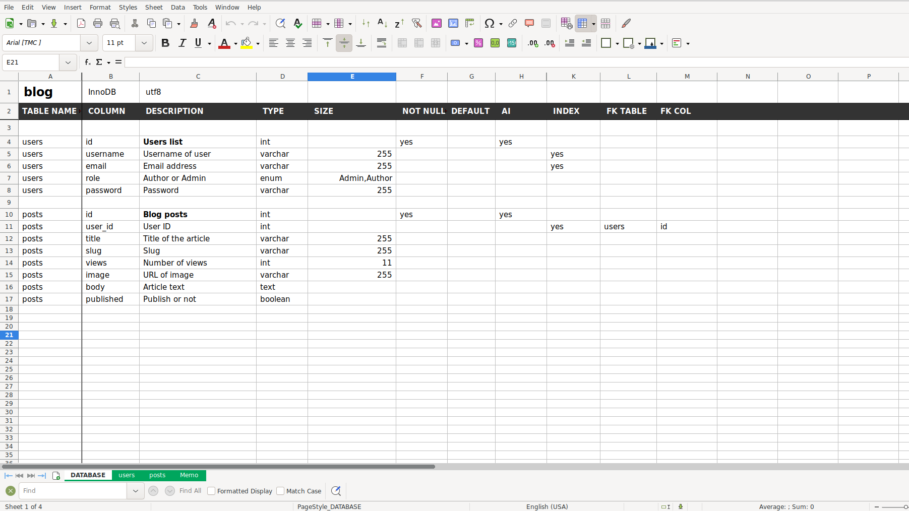
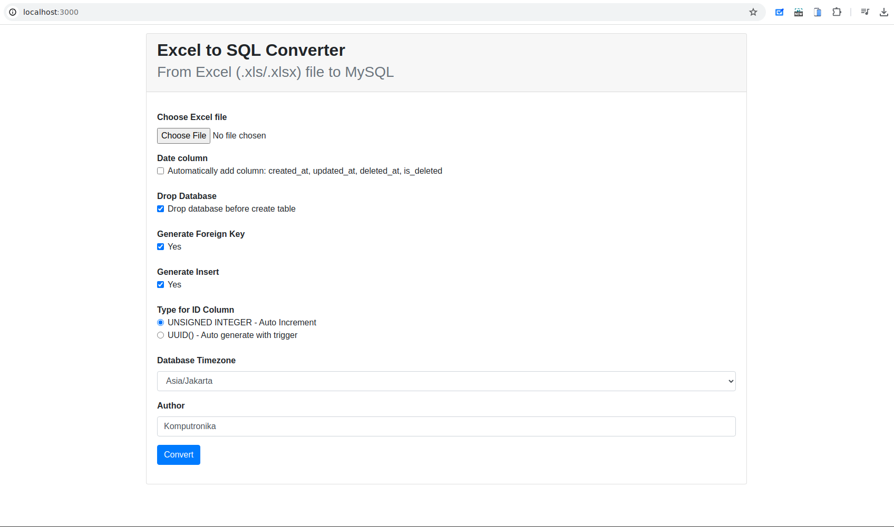
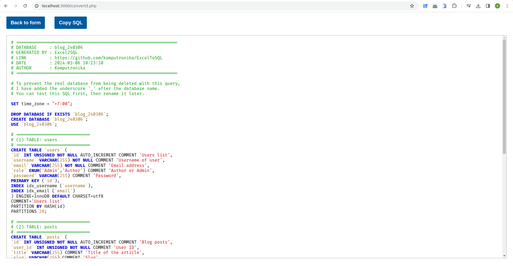

# MySQL Schema Generator from Excel/Spreadsheet File

Design MySQL database schema using Excel (or any spreadsheet software), then convert it into SQL language that can be executed on the MySQL server.

##### Usage:

Just download source code and run in your browser.

##### Screenshots:

###### Excel Template

###### Form

###### SQL Output

